# Flux complet : Obtention et Sauvegarde du Token FCM

## 🔄 Vue d'ensemble

Le token FCM (Firebase Cloud Messaging) est généré côté client et doit être sauvegardé dans Firestore pour permettre l'envoi de notifications push.

```mermaid
sequenceDiagram
    participant Client as VueJS App
    participant Firebase as Firebase SDK
    participant API as Backend API
    participant Firestore as Firestore DB

    Client->>Firebase: Demander permission notifications
    Firebase-->>Client: Permission accordée
    Client->>Firebase: Demander token FCM
    Firebase-->>Client: Token FCM généré
    Client->>API: PUT /api/utilisateurs/me (fcm_token)
    API->>Firestore: Mettre à jour document utilisateur
    Firestore-->>API: Confirmation
    API-->>Client: Token sauvegardé
```



## 📱 Partie 1 : Obtention du Token FCM côté VueJS

### Option A : Mobile natif (Android/iOS avec Capacitor)

```typescript
// src/services/fcmService.ts
import { PushNotifications, Token } from "@capacitor/push-notifications";
import { isPlatform } from "@ionic/vue";

export class FCMService {
  private fcmToken: string | null = null;

  /**
   * Obtenir le token FCM sur mobile natif
   */
  async getNativeToken(): Promise<string | null> {
    if (!isPlatform("capacitor")) {
      console.error("Cette méthode est uniquement pour mobile natif");
      return null;
    }

    try {
      // 1. Demander la permission
      const permission = await PushNotifications.requestPermissions();

      if (permission.receive !== "granted") {
        console.error("❌ Permission refusée");
        return null;
      }

      // 2. Enregistrer pour recevoir les notifications
      await PushNotifications.register();

      // 3. Écouter l'événement de génération du token
      return new Promise((resolve, reject) => {
        // Timeout après 10 secondes
        const timeout = setTimeout(() => {
          reject(new Error("Timeout: Token FCM non reçu"));
        }, 10000);

        PushNotifications.addListener("registration", (token: Token) => {
          clearTimeout(timeout);
          console.log("✅ Token FCM reçu:", token.value);
          this.fcmToken = token.value;
          resolve(token.value);
        });

        PushNotifications.addListener("registrationError", (error: any) => {
          clearTimeout(timeout);
          console.error("❌ Erreur génération token:", error);
          reject(error);
        });
      });
    } catch (error) {
      console.error("❌ Erreur obtention token FCM:", error);
      return null;
    }
  }

  /**
   * Obtenir le token stocké en mémoire
   */
  getToken(): string | null {
    return this.fcmToken;
  }
}

export default new FCMService();
```

### Option B : Web (PWA)

```typescript
// src/services/fcmService.ts
import { getMessaging, getToken } from "firebase/messaging";
import { initializeApp } from "firebase/app";

const firebaseConfig = {
  apiKey: "VOTRE_API_KEY",
  authDomain: "VOTRE_PROJECT.firebaseapp.com",
  projectId: "VOTRE_PROJECT_ID",
  storageBucket: "VOTRE_PROJECT.appspot.com",
  messagingSenderId: "VOTRE_SENDER_ID",
  appId: "VOTRE_APP_ID",
};

const app = initializeApp(firebaseConfig);
const messaging = getMessaging(app);

/**
 * Obtenir le token FCM sur web
 */
export async function getWebToken(): Promise<string | null> {
  try {
    // 1. Demander la permission
    const permission = await Notification.requestPermission();

    if (permission !== "granted") {
      console.error("❌ Permission refusée");
      return null;
    }

    // 2. Obtenir le token FCM
    const vapidKey = "VOTRE_VAPID_KEY"; // Depuis Firebase Console
    const token = await getToken(messaging, { vapidKey });

    if (token) {
      console.log("✅ Token FCM obtenu:", token);
      return token;
    } else {
      console.error("❌ Token FCM non disponible");
      return null;
    }
  } catch (error) {
    console.error("❌ Erreur obtention token FCM:", error);
    return null;
  }
}
```

### Service unifié (Mobile + Web)

```typescript
// src/services/fcmService.ts
import { PushNotifications, Token } from "@capacitor/push-notifications";
import { getMessaging, getToken } from "firebase/messaging";
import { initializeApp } from "firebase/app";
import { isPlatform } from "@ionic/vue";

const firebaseConfig = {
  apiKey: import.meta.env.VITE_FIREBASE_API_KEY,
  authDomain: import.meta.env.VITE_FIREBASE_AUTH_DOMAIN,
  projectId: import.meta.env.VITE_FIREBASE_PROJECT_ID,
  storageBucket: import.meta.env.VITE_FIREBASE_STORAGE_BUCKET,
  messagingSenderId: import.meta.env.VITE_FIREBASE_MESSAGING_SENDER_ID,
  appId: import.meta.env.VITE_FIREBASE_APP_ID,
};

class FCMService {
  private fcmToken: string | null = null;
  private app = initializeApp(firebaseConfig);
  private messaging = getMessaging(this.app);

  /**
   * Obtenir le token FCM (détecte automatiquement la plateforme)
   */
  async getToken(): Promise<string | null> {
    if (this.fcmToken) {
      return this.fcmToken; // Retourner le token en cache
    }

    if (isPlatform("capacitor")) {
      return await this.getNativeToken();
    } else {
      return await this.getWebToken();
    }
  }

  /**
   * Token sur mobile natif
   */
  private async getNativeToken(): Promise<string | null> {
    try {
      const permission = await PushNotifications.requestPermissions();
      if (permission.receive !== "granted") return null;

      await PushNotifications.register();

      return new Promise((resolve, reject) => {
        const timeout = setTimeout(() => reject(new Error("Timeout")), 10000);

        PushNotifications.addListener("registration", (token: Token) => {
          clearTimeout(timeout);
          this.fcmToken = token.value;
          resolve(token.value);
        });

        PushNotifications.addListener("registrationError", (error) => {
          clearTimeout(timeout);
          reject(error);
        });
      });
    } catch (error) {
      console.error("Erreur token natif:", error);
      return null;
    }
  }

  /**
   * Token sur web
   */
  private async getWebToken(): Promise<string | null> {
    try {
      const permission = await Notification.requestPermission();
      if (permission !== "granted") return null;

      const vapidKey = import.meta.env.VITE_FIREBASE_VAPID_KEY;
      const token = await getToken(this.messaging, { vapidKey });

      if (token) {
        this.fcmToken = token;
        return token;
      }
      return null;
    } catch (error) {
      console.error("Erreur token web:", error);
      return null;
    }
  }

  /**
   * Rafraîchir le token
   */
  async refreshToken(): Promise<string | null> {
    this.fcmToken = null;
    return await this.getToken();
  }
}

export default new FCMService();
```

## 🔧 Partie 2 : Sauvegarde du Token dans Firestore

### Option A : Via une fonction Firebase (Recommandé)

Créez une nouvelle fonction dans `firebase/functions/src/utilisateurs/updateFcmToken.ts` :

```typescript
import * as functions from "firebase-functions";
import * as admin from "firebase-admin";
import {
  db,
  successResponse,
  errorResponse,
  extractToken,
  verifyToken,
  getUserInfo,
} from "../utils/helpers";

/**
 * PUT /api/utilisateurs/fcm-token
 * Mettre à jour le token FCM de l'utilisateur connecté
 */
export const updateFcmToken = functions.https.onRequest(async (req, res) => {
  res.set("Access-Control-Allow-Origin", "*");
  res.set("Access-Control-Allow-Methods", "PUT, OPTIONS");
  res.set("Access-Control-Allow-Headers", "Content-Type, Authorization");

  if (req.method === "OPTIONS") {
    res.status(204).send("");
    return;
  }

  if (req.method !== "PUT") {
    const response = errorResponse(
      "METHOD_NOT_ALLOWED",
      "Méthode non autorisée",
      405,
    );
    res.status(response.status).json(response.body);
    return;
  }

  try {
    const token = extractToken(req);

    if (!token) {
      const response = errorResponse("AUTH_REQUIRED", "Token requis", 401);
      res.status(response.status).json(response.body);
      return;
    }

    const decodedToken = await verifyToken(token);

    if (!decodedToken) {
      const response = errorResponse("UNAUTHORIZED", "Token invalide", 401);
      res.status(response.status).json(response.body);
      return;
    }

    const { fcm_token } = req.body;

    if (!fcm_token) {
      const response = errorResponse(
        "VALIDATION_ERROR",
        "Le token FCM est requis",
        400,
      );
      res.status(response.status).json(response.body);
      return;
    }

    const userInfo = await getUserInfo(decodedToken.uid);

    if (!userInfo || !userInfo.id) {
      const response = errorResponse(
        "USER_NOT_FOUND",
        "Utilisateur non trouvé",
        404,
      );
      res.status(response.status).json(response.body);
      return;
    }

    // Récupérer le document utilisateur
    const utilisateurSnapshot = await db
      .collection("utilisateurs")
      .where("id", "==", userInfo.id)
      .limit(1)
      .get();

    if (utilisateurSnapshot.empty) {
      const response = errorResponse(
        "USER_NOT_FOUND",
        "Document utilisateur non trouvé",
        404,
      );
      res.status(response.status).json(response.body);
      return;
    }

    const utilisateurDoc = utilisateurSnapshot.docs[0];

    // Mettre à jour le token FCM
    await utilisateurDoc.ref.update({
      fcm_token: fcm_token,
      fcm_token_updated_at: admin.firestore.FieldValue.serverTimestamp(),
    });

    console.log(`✅ Token FCM mis à jour pour l'utilisateur ${userInfo.id}`);

    const response = successResponse({
      message: "Token FCM enregistré avec succès",
      data: {
        id: userInfo.id,
        fcm_token_registered: true,
      },
    });

    res.status(response.status).json(response.body);
  } catch (error: any) {
    console.error("❌ Erreur mise à jour token FCM:", error);
    const response = errorResponse("INTERNAL_ERROR", error.message, 500);
    res.status(response.status).json(response.body);
  }
});

/**
 * DELETE /api/utilisateurs/fcm-token
 * Supprimer le token FCM de l'utilisateur (déconnexion)
 */
export const deleteFcmToken = functions.https.onRequest(async (req, res) => {
  res.set("Access-Control-Allow-Origin", "*");
  res.set("Access-Control-Allow-Methods", "DELETE, OPTIONS");
  res.set("Access-Control-Allow-Headers", "Content-Type, Authorization");

  if (req.method === "OPTIONS") {
    res.status(204).send("");
    return;
  }

  if (req.method !== "DELETE") {
    const response = errorResponse(
      "METHOD_NOT_ALLOWED",
      "Méthode non autorisée",
      405,
    );
    res.status(response.status).json(response.body);
    return;
  }

  try {
    const token = extractToken(req);

    if (!token) {
      const response = errorResponse("AUTH_REQUIRED", "Token requis", 401);
      res.status(response.status).json(response.body);
      return;
    }

    const decodedToken = await verifyToken(token);

    if (!decodedToken) {
      const response = errorResponse("UNAUTHORIZED", "Token invalide", 401);
      res.status(response.status).json(response.body);
      return;
    }

    const userInfo = await getUserInfo(decodedToken.uid);

    if (!userInfo || !userInfo.id) {
      const response = errorResponse(
        "USER_NOT_FOUND",
        "Utilisateur non trouvé",
        404,
      );
      res.status(response.status).json(response.body);
      return;
    }

    // Récupérer le document utilisateur
    const utilisateurSnapshot = await db
      .collection("utilisateurs")
      .where("id", "==", userInfo.id)
      .limit(1)
      .get();

    if (utilisateurSnapshot.empty) {
      const response = errorResponse(
        "USER_NOT_FOUND",
        "Document utilisateur non trouvé",
        404,
      );
      res.status(response.status).json(response.body);
      return;
    }

    const utilisateurDoc = utilisateurSnapshot.docs[0];

    // Supprimer le token FCM
    await utilisateurDoc.ref.update({
      fcm_token: admin.firestore.FieldValue.delete(),
    });

    console.log(`✅ Token FCM supprimé pour l'utilisateur ${userInfo.id}`);

    const response = successResponse({
      message: "Token FCM supprimé avec succès",
    });

    res.status(response.status).json(response.body);
  } catch (error: any) {
    console.error("❌ Erreur suppression token FCM:", error);
    const response = errorResponse("INTERNAL_ERROR", error.message, 500);
    res.status(response.status).json(response.body);
  }
});
```

Puis exportez dans `firebase/functions/src/index.ts` :

```typescript
// Token FCM
export { updateFcmToken, deleteFcmToken } from "./utilisateurs/updateFcmToken";
```

### Option B : Directement depuis le client (Alternative)

Si vous utilisez les règles Firestore pour autoriser l'utilisateur à modifier son propre document :

```typescript
// firestore.rules
rules_version = '2';
service cloud.firestore {
  match /databases/{database}/documents {
    match /utilisateurs/{userId} {
      // Permettre à l'utilisateur de modifier uniquement son token FCM
      allow update: if request.auth != null
                    && request.resource.data.diff(resource.data).affectedKeys().hasOnly(['fcm_token', 'fcm_token_updated_at'])
                    && request.resource.data.id == resource.data.id;
    }
  }
}
```

```typescript
// src/services/fcmService.ts (suite)
import { getFirestore, doc, updateDoc, serverTimestamp } from 'firebase/firestore';

/**
 * Sauvegarder directement dans Firestore (si les règles le permettent)
 */
async saveTokenDirectly(userId: number, fcmToken: string): Promise<void> {
  try {
    const db = getFirestore();

    // Trouver le document avec l'ID numérique
    const utilisateursRef = collection(db, 'utilisateurs');
    const q = query(utilisateursRef, where('id', '==', userId), limit(1));
    const snapshot = await getDocs(q);

    if (!snapshot.empty) {
      const docRef = snapshot.docs[0].ref;
      await updateDoc(docRef, {
        fcm_token: fcmToken,
        fcm_token_updated_at: serverTimestamp()
      });
      console.log('✅ Token FCM sauvegardé directement');
    }
  } catch (error) {
    console.error('❌ Erreur sauvegarde directe:', error);
    throw error;
  }
}
```

## 🎯 Partie 3 : Intégration complète dans VueJS

### Service d'authentification avec gestion du token FCM

```typescript
// src/services/authService.ts
import axios from "axios";
import fcmService from "./fcmService";

const API_URL = import.meta.env.VITE_API_URL;

interface LoginResponse {
  token: string;
  user: {
    id: number;
    email: string;
    nom: string;
  };
}

class AuthService {
  /**
   * Connexion avec enregistrement automatique du token FCM
   */
  async login(email: string, password: string): Promise<LoginResponse> {
    try {
      // 1. Connexion classique
      const response = await axios.post<LoginResponse>(
        `${API_URL}/api/auth/login`,
        {
          email,
          password,
        },
      );

      const { token, user } = response.data;

      // 2. Sauvegarder le token d'auth
      localStorage.setItem("auth_token", token);
      localStorage.setItem("user", JSON.stringify(user));

      // 3. Obtenir et sauvegarder le token FCM
      await this.registerFcmToken(token);

      return response.data;
    } catch (error) {
      console.error("Erreur de connexion:", error);
      throw error;
    }
  }

  /**
   * Enregistrer le token FCM après connexion
   */
  async registerFcmToken(authToken: string): Promise<void> {
    try {
      // Obtenir le token FCM
      const fcmToken = await fcmService.getToken();

      if (!fcmToken) {
        console.warn("⚠️ Token FCM non disponible");
        return;
      }

      // Sauvegarder dans Firestore via l'API
      await axios.put(
        `${API_URL}/api/utilisateurs/fcm-token`,
        { fcm_token: fcmToken },
        {
          headers: {
            Authorization: `Bearer ${authToken}`,
          },
        },
      );

      console.log("✅ Token FCM enregistré avec succès");
    } catch (error) {
      console.error("❌ Erreur enregistrement token FCM:", error);
      // Ne pas bloquer la connexion si l'enregistrement échoue
    }
  }

  /**
   * Déconnexion avec suppression du token FCM
   */
  async logout(): Promise<void> {
    try {
      const token = localStorage.getItem("auth_token");

      if (token) {
        // Supprimer le token FCM du serveur
        await axios.delete(`${API_URL}/api/utilisateurs/fcm-token`, {
          headers: {
            Authorization: `Bearer ${token}`,
          },
        });
      }

      // Nettoyer le localStorage
      localStorage.removeItem("auth_token");
      localStorage.removeItem("user");

      console.log("✅ Déconnexion réussie");
    } catch (error) {
      console.error("Erreur de déconnexion:", error);
      // Nettoyer quand même
      localStorage.clear();
    }
  }
}

export default new AuthService();
```

### Composant de connexion

```vue
<template>
  <ion-page>
    <ion-content class="ion-padding">
      <h1>Connexion</h1>

      <form @submit.prevent="handleLogin">
        <ion-item>
          <ion-label position="floating">Email</ion-label>
          <ion-input v-model="email" type="email" required></ion-input>
        </ion-item>

        <ion-item>
          <ion-label position="floating">Mot de passe</ion-label>
          <ion-input v-model="password" type="password" required></ion-input>
        </ion-item>

        <ion-button expand="block" type="submit" :disabled="loading">
          <ion-spinner v-if="loading" name="crescent"></ion-spinner>
          <span v-else>Se connecter</span>
        </ion-button>
      </form>

      <ion-toast
        :is-open="showToast"
        :message="toastMessage"
        :duration="3000"
        @didDismiss="showToast = false"
      ></ion-toast>
    </ion-content>
  </ion-page>
</template>

<script setup lang="ts">
import { ref } from "vue";
import { useRouter } from "vue-router";
import {
  IonPage,
  IonContent,
  IonItem,
  IonLabel,
  IonInput,
  IonButton,
  IonToast,
  IonSpinner,
} from "@ionic/vue";
import authService from "@/services/authService";

const router = useRouter();

const email = ref("");
const password = ref("");
const loading = ref(false);
const showToast = ref(false);
const toastMessage = ref("");

const handleLogin = async () => {
  loading.value = true;

  try {
    await authService.login(email.value, password.value);

    toastMessage.value = "✅ Connexion réussie ! Token FCM enregistré.";
    showToast.value = true;

    setTimeout(() => {
      router.push("/home");
    }, 1000);
  } catch (error: any) {
    console.error("Erreur:", error);
    toastMessage.value = "❌ Erreur de connexion";
    showToast.value = true;
  } finally {
    loading.value = false;
  }
};
</script>
```

## ✅ Vérification : Comment tester le flux complet

### 1. Vérifier que le token est obtenu

```typescript
// Dans la console du navigateur ou dans votre code
import fcmService from "./services/fcmService";

const token = await fcmService.getToken();
console.log("Token FCM:", token);
```

### 2. Vérifier dans Firestore

Dans Firebase Console → Firestore Database → Collection `utilisateurs` → Document de votre utilisateur

Vous devriez voir :

```json
{
  "id": 123,
  "email": "user@example.com",
  "fcm_token": "fXh4kD3...lH8j9", // ← Le token FCM
  "fcm_token_updated_at": "2026-02-10T10:30:00Z"
}
```

### 3. Tester l'envoi d'une notification

```typescript
// Créer un avancement pour déclencher le trigger
await axios.post(
  `${API_URL}/api/avancements`,
  {
    id_signalement: 1,
    id_statut_avancement: 2,
    commentaire: "Test notification",
  },
  {
    headers: { Authorization: `Bearer ${token}` },
  },
);

// Le trigger devrait automatiquement envoyer la notification
```

## 🔍 Debugging

### Vérifier si le token est bien généré

```typescript
console.log("Plateforme:", isPlatform("capacitor") ? "Mobile" : "Web");
fcmService.getToken().then((token) => {
  if (token) {
    console.log("✅ Token obtenu:", token.substring(0, 20) + "...");
  } else {
    console.error("❌ Pas de token");
  }
});
```

### Vérifier les logs du trigger Firebase

```bash
firebase functions:log --only notifyUserOnAvancement
```

### Logs attendus

```
✅ Token FCM obtenu: fXh4kD3R...
✅ Token FCM enregistré avec succès
✅ Notification envoyée avec succès à l'utilisateur 123
✅ Notification enregistrée dans la collection "notifications"
```

## 📝 Résumé du flux

1. **Utilisateur se connecte** → `authService.login()`
2. **Obtenir le token FCM** → `fcmService.getToken()`
3. **Sauvegarder dans Firestore** → `PUT /api/utilisateurs/fcm-token`
4. **Document utilisateur mis à jour** avec le champ `fcm_token`
5. **Trigger activé** quand un nouvel avancement est créé
6. **Trigger lit le `fcm_token`** depuis le document utilisateur
7. **Notification envoyée** via Firebase Cloud Messaging
8. **Utilisateur reçoit la notification** sur son appareil

## ⚠️ Points importants

- Le token FCM doit être **régénéré** si l'utilisateur se déconnecte puis se reconnecte
- Sur **iOS**, les notifications nécessitent un **device réel** (pas de simulateur)
- Sur **Web**, nécessite **HTTPS** (sauf localhost)
- Le token peut **expirer** → prévoir un mécanisme de rafraîchissement
- Toujours **supprimer le token** lors de la déconnexion
