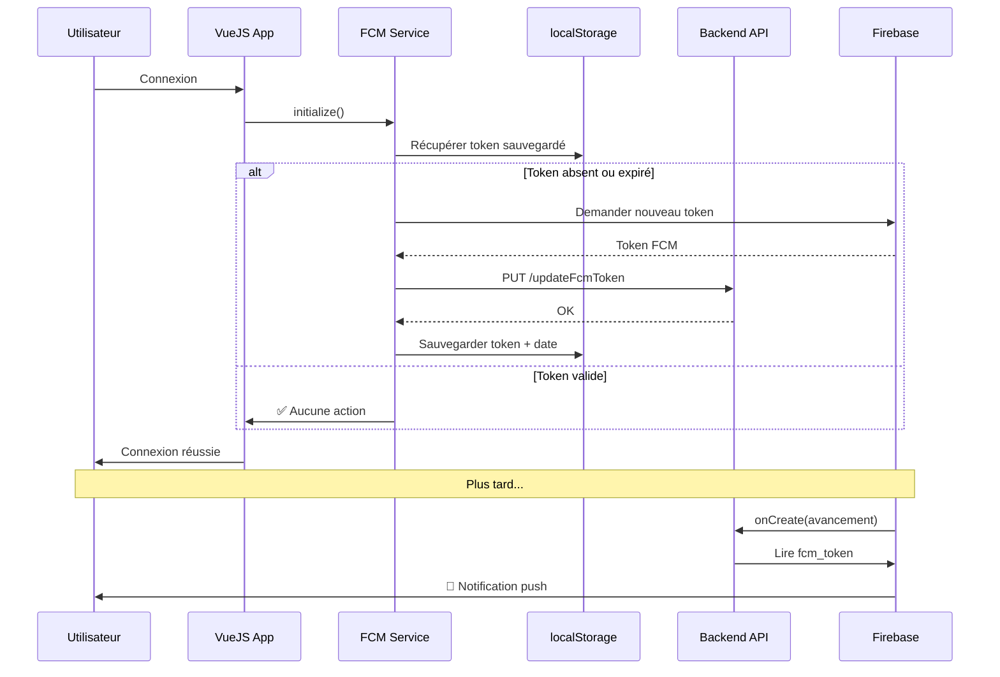

# 📱 Exemples d'Intégration FCM - Guide Complet

> Guide pratique pour intégrer le système de notifications optimisé dans votre application VueJS/Ionic

## 📁 Fichiers d'Exemple Fournis

| Fichier                   | Description                         | Utilisation                                  |
| ------------------------- | ----------------------------------- | -------------------------------------------- |
| `fcmService-optimized.ts` | Service FCM intelligent avec cache  | **À intégrer tel quel** dans `src/services/` |
| `authService-example.ts`  | Service d'authentification avec FCM | **À adapter** selon votre auth existant      |
| `LoginPage-example.vue`   | Composant de connexion complet      | **À adapter** selon votre UI                 |
| `main-example.ts`         | Initialisation de l'app avec FCM    | **À adapter** dans votre `main.ts`           |

---

## 🚀 Intégration Étape par Étape

### 1️⃣ Copier le Service FCM Optimisé

```bash
# Copier le service dans votre projet
cp firebase/fcmService-optimized.ts projet/frontend-web/src/services/fcmService.ts
# ou
cp firebase/fcmService-optimized.ts projet/roadwork-mobile/src/services/fcmService.ts
```

**Configuration requise** dans `fcmService.ts` :

```typescript
// ⚠️ IMPORTANT: Remplacer par votre configuration Firebase
const firebaseConfig = {
  apiKey: "VOTRE_API_KEY",
  authDomain: "projet-cloud-e2146.firebaseapp.com",
  projectId: "projet-cloud-e2146",
  storageBucket: "projet-cloud-e2146.appspot.com",
  messagingSenderId: "VOTRE_SENDER_ID",
  appId: "VOTRE_APP_ID",
};
```

### 2️⃣ Installer les Dépendances

#### Pour VueJS (Web)

```bash
cd projet/frontend-web
npm install firebase axios
```

#### Pour Ionic (Mobile)

```bash
cd projet/roadwork-mobile
npm install firebase axios @capacitor/push-notifications
npx cap sync
```

### 3️⃣ Intégrer dans l'Authentification

**Option A : Service d'authentification existant**

Si vous avez déjà un `authService.ts`, ajoutez ces méthodes :

```typescript
import fcmService from "./fcmService";

class AuthService {
  async login(email: string, password: string) {
    // Votre logique de connexion existante...
    const response = await axios.post("/login", { email, password });

    // 🆕 Ajouter après une connexion réussie
    await fcmService.initialize();

    return response.data;
  }

  async logout() {
    // 🆕 Ajouter avant la déconnexion
    await fcmService.deleteToken();

    // Votre logique de déconnexion existante...
    localStorage.clear();
  }
}
```

**Option B : Nouveau service (utiliser `authService-example.ts`)**

```bash
cp firebase/authService-example.ts projet/frontend-web/src/services/authService.ts
```

Puis adaptez l'`API_URL` :

```typescript
const API_URL = import.meta.env.VITE_API_URL || "https://votre-api.com";
```

### 4️⃣ Intégrer dans le Composant de Connexion

#### Avec VueJS 3 Composition API

```vue
<script setup lang="ts">
import { ref } from "vue";
import authService from "@/services/authService";

const handleLogin = async () => {
  try {
    // ✅ Le service initialize() gère automatiquement la vérification du token
    await authService.login(email.value, password.value);

    // Redirection...
    router.push("/dashboard");
  } catch (error) {
    console.error("Erreur de connexion:", error);
  }
};
</script>
```

#### Avec VueJS 3 Options API

```vue
<script lang="ts">
import { defineComponent } from "vue";
import authService from "@/services/authService";

export default defineComponent({
  methods: {
    async handleLogin() {
      try {
        await authService.login(this.email, this.password);
        this.$router.push("/dashboard");
      } catch (error) {
        console.error("Erreur de connexion:", error);
      }
    },
  },
});
</script>
```

### 5️⃣ Initialiser au Démarrage de l'App

**Dans `src/main.ts`** :

```typescript
import { createApp } from "vue";
import App from "./App.vue";
import authService from "./services/authService";

const app = createApp(App);

// 🆕 Vérifier et rafraîchir le token au démarrage
async function initApp() {
  if (authService.isAuthenticated()) {
    await authService.checkAndRefreshFcmToken();
  }
}

app.mount("#app");
initApp();
```

**ℹ️ Pour une initialisation complète**, référez-vous à `main-example.ts` qui inclut :

- Listeners de notifications en premier plan
- Vérification périodique du token
- Gestion reconnexion/focus

---

## 🎯 Fonctionnement Intelligent du Service

### Quand le Token est-il Mis à Jour ?

Le service `fcmService.initialize()` **vérifie automatiquement** 5 conditions :

1. ✅ **Première fois** → Token enregistré
2. ✅ **Token changé** → Token mis à jour
3. ✅ **Pas de date de mise à jour** → Token enregistré
4. ✅ **Token expiré (>6 mois)** → Token rafraîchi
5. ❌ **Token valide et récent** → **Aucun appel API**

### Exemple de Logs

```
🔍 Vérification du token FCM local...
✅ Token valide (dernière mise à jour: il y a 2 jours)
⏭️ Aucune mise à jour nécessaire
```

---

## 🧪 Tests et Vérification

### 1. Tester l'Enregistrement du Token

```typescript
// Dans la console du navigateur (après connexion)
const token = await fcmService.getCurrentToken();
console.log("Token FCM:", token);
console.log("Token valide:", fcmService.isTokenValid());
```

### 2. Forcer un Rafraîchissement

```typescript
// Pour tester la mise à jour
await fcmService.forceRefresh();
console.log("Token rafraîchi:", await fcmService.getCurrentToken());
```

### 3. Simuler une Notification

Créez un document dans Firestore `avancements_signalement` :

```json
{
  "signalement_id": 1,
  "statut_avancement_id": 2,
  "description": "Test de notification",
  "photo_url": "https://example.com/photo.jpg",
  "date_avancement": "2024-01-15T10:30:00Z",
  "utilisateur_id": 1
}
```

**Attendu** : L'utilisateur avec `id: 1` reçoit une notification push.

### 4. Vérifier les Logs Firebase

```bash
# Dans le terminal
firebase functions:log --only notifyUserOnAvancement
```

---

## 🔧 Configuration Firebase Console

### Pour Web (VAPID)

1. Aller sur [Firebase Console](https://console.firebase.google.com)
2. Projet → **Paramètres** → **Cloud Messaging**
3. Section **"Web Push certificates"**
4. Cliquer sur **"Generate key pair"**
5. Copier la clé publique dans `fcmService.ts` :

```typescript
await getToken(messaging, {
  vapidKey: "VOTRE_CLE_VAPID_PUBLIQUE",
});
```

### Pour iOS (APNs)

1. Firebase Console → **Paramètres** → **Cloud Messaging**
2. Section **"Apple app configuration"**
3. Uploader votre fichier **APNs Auth Key** (.p8)

### Pour Android

Aucune configuration supplémentaire requise (Google Cloud Messaging).

---

## 📊 Architecture Complète



---

## ⚠️ Résolution de Problèmes

### Problème : Notifications non reçues

**Solutions :**

1. Vérifier les permissions :

```typescript
const permission = await Notification.requestPermission();
console.log("Permission:", permission); // Doit être "granted"
```

2. Vérifier le token dans Firestore :

```bash
# Firebase CLI
firebase firestore:get utilisateurs/1
```

Le champ `fcm_token` doit exister et ne pas être vide.

3. Vérifier les logs Firebase :

```bash
firebase functions:log --only notifyUserOnAvancement
```

### Problème : Token mis à jour à chaque connexion

**Cause probable** : localStorage nettoyé ou désactivé

**Solution** : Vérifier que `localStorage` fonctionne :

```typescript
localStorage.setItem("test", "ok");
console.log(localStorage.getItem("test")); // Doit afficher "ok"
```

### Problème : Erreur "Permission denied"

**Cause** : L'utilisateur a refusé les permissions

**Solution** : Demander à nouveau :

```typescript
await fcmService.requestPermission();
```

---

## 📚 Documentation Complète

| Document                                                   | Description                            |
| ---------------------------------------------------------- | -------------------------------------- |
| [NOTIFICATION_FLOW_GUIDE.md](./NOTIFICATION_FLOW_GUIDE.md) | Guide complet du flux de notifications |
| [FCM_TOKEN_FLOW.md](./FCM_TOKEN_FLOW.md)                   | Détails du système de tokens           |
| [firebase-api.md](./doc%20technique/api/firebase-api.md)   | Documentation des endpoints API        |

---

## ✅ Checklist d'Intégration

- [ ] Copier `fcmService-optimized.ts` dans `src/services/`
- [ ] Configurer Firebase (apiKey, etc.)
- [ ] Installer dépendances (`firebase`, `axios`, `@capacitor/push-notifications`)
- [ ] Intégrer `fcmService.initialize()` dans le login
- [ ] Intégrer `fcmService.deleteToken()` dans le logout
- [ ] Initialiser au démarrage dans `main.ts`
- [ ] Configurer VAPID dans Firebase Console
- [ ] Tester l'enregistrement du token
- [ ] Tester la réception de notifications
- [ ] Vérifier les logs Firebase

---

## 🎓 Bonnes Pratiques

### ✅ À Faire

- Appeler `initialize()` après une connexion réussie
- Appeler `deleteToken()` avant la déconnexion
- Vérifier périodiquement le token (7 jours recommandé)
- Gérer les erreurs avec `try/catch`
- Logger les événements importants

### ❌ À Éviter

- Appeler `initialize()` à chaque navigation
- Mettre à jour le token manuellement sans vérification
- Ignorer les erreurs de permission
- Vider localStorage sans supprimer le token du serveur
- Tester en navigation privée (localStorage désactivé)

---

## 🙋 Besoin d'Aide ?

Consultez les guides :

- [NOTIFICATION_FLOW_GUIDE.md](./NOTIFICATION_FLOW_GUIDE.md) - Scénarios de dépannage
- [firebase-api.md](./doc%20technique/api/firebase-api.md) - Référence API

Ou vérifiez les logs Firebase :

```bash
firebase functions:log --only notifyUserOnAvancement --limit 50
```
