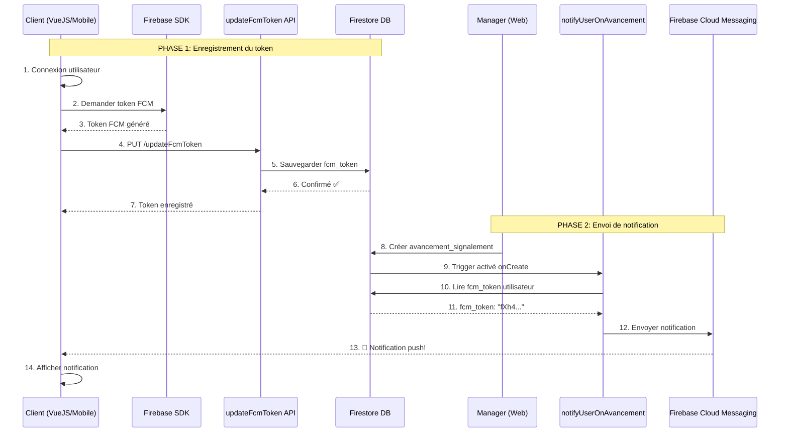

# Guide Complet : Flux des Notifications Push

## 🔄 Vue d'ensemble du système

Le système de notifications push fonctionne en **3 étapes principales** :

```
1. Enregistrement du token FCM (côté client)
   ↓
2. Stockage dans Firestore (updateFcmToken)
   ↓
3. Envoi automatique des notifications (notifyUserOnAvancement - Trigger)
```

---

## 📱 Étape 1 : Côté Client (VueJS/Ionic/Mobile)

### 1.1 Connexion de l'utilisateur

```typescript
// L'utilisateur se connecte
const response = await axios.post("/login", {
  email: "user@example.com",
  password: "password123",
});

const { token, user } = response.data;
localStorage.setItem("auth_token", token);
```

### 1.2 Obtention du token FCM

```typescript
// Après la connexion, obtenir le token FCM
import fcmService from "@/services/fcmService";

const fcmToken = await fcmService.getToken();
// Exemple: "fXh4kD3R7bQ:APA91bH8j9K..."

console.log("Token FCM obtenu:", fcmToken);
```

### 1.3 Enregistrement du token dans Firestore (Approche optimisée)

#### Option A : Enregistrement intelligent (Recommandé)

```typescript
// Vérifier si le token a changé avant de l'envoyer
const savedToken = localStorage.getItem("fcm_token");
const currentToken = await fcmService.getToken();

// Envoyer uniquement si :
// 1. Pas de token sauvegardé localement
// 2. Le token a changé
if (!savedToken || savedToken !== currentToken) {
  await axios.put(
    "https://us-central1-projet-cloud-e2146.cloudfunctions.net/updateFcmToken",
    { fcm_token: currentToken },
    {
      headers: {
        Authorization: `Bearer ${localStorage.getItem("auth_token")}`,
      },
    },
  );

  // Sauvegarder localement pour la prochaine fois
  localStorage.setItem("fcm_token", currentToken);
  console.log("✅ Nouveau token FCM enregistré");
} else {
  console.log("✅ Token FCM déjà à jour, pas besoin de mise à jour");
}
```

#### Option B : Enregistrement unique lors de la première connexion

```typescript
// Enregistrer le token seulement s'il n'existe pas
const hasRegisteredToken = localStorage.getItem("fcm_token_registered");

if (!hasRegisteredToken) {
  const fcmToken = await fcmService.getToken();

  await axios.put(
    "https://us-central1-projet-cloud-e2146.cloudfunctions.net/updateFcmToken",
    { fcm_token: fcmToken },
    {
      headers: {
        Authorization: `Bearer ${localStorage.getItem("auth_token")}`,
      },
    },
  );

  // Marquer comme enregistré
  localStorage.setItem("fcm_token", fcmToken);
  localStorage.setItem("fcm_token_registered", "true");
  console.log("✅ Token FCM enregistré pour la première fois");
} else {
  console.log("✅ Token FCM déjà enregistré, aucune action nécessaire");
}
```

**✅ Avantages de cette approche** :

- Moins d'appels API inutiles
- Meilleure performance
- Réduit la charge sur le serveur
- Le même token fonctionne sur toutes les sessions

**⚠️ Limitations** :

- Le token peut expirer (rafraîchir tous les 6 mois)
- Si l'utilisateur change d'appareil → nouveau token
- Si l'utilisateur efface le cache → réenregistrement nécessaire

---

## 🔧 Étape 2 : Backend - Stockage du Token (`updateFcmToken`)

### 2.1 Endpoint appelé

```
PUT /updateFcmToken
```

### 2.2 Ce que fait la fonction

```typescript
// 1. Vérifie l'authentification
const decodedToken = await verifyToken(token);

// 2. Récupère l'utilisateur
const userInfo = await getUserInfo(decodedToken.uid);

// 3. Met à jour le document utilisateur dans Firestore
await utilisateurDoc.ref.update({
  fcm_token: fcm_token,
  fcm_token_updated_at: admin.firestore.FieldValue.serverTimestamp(),
});
```

### 2.3 Résultat dans Firestore

```json
// Collection "utilisateurs" → Document de l'utilisateur
{
  "id": 123,
  "email": "user@example.com",
  "nom": "Dupont",
  "prenom": "Jean",
  "fcm_token": "fXh4kD3R7bQ:APA91bH8j9K...", // ← Token sauvegardé
  "fcm_token_updated_at": "2026-02-10T14:30:00Z"
}
```

---

## 🔔 Étape 3 : Envoi Automatique des Notifications (`notifyUserOnAvancement`)

### 3.1 Déclenchement du trigger

Le trigger s'active **automatiquement** quand :

- Un nouveau document est créé dans `avancements_signalement`
- Exemple : Un manager change le statut d'un signalement

```typescript
// Quelqu'un crée un nouvel avancement
await firestore.collection("avancements_signalement").add({
  id_signalement: 456,
  id_utilisateur: 123, // ← L'utilisateur qui sera notifié
  id_statut_avancement: 2,
  date_modification: new Date(),
});

// → Le trigger notifyUserOnAvancement s'exécute immédiatement
```

### 3.2 Processus du trigger

```typescript
// 1. Récupère l'utilisateur concerné
const utilisateurSnapshot = await firestore
  .collection("utilisateurs")
  .where("id", "==", Number(idUtilisateur))
  .get();

const utilisateurData = utilisateurSnapshot.docs[0].data();

// 2. Vérifie la présence du token FCM
const fcmToken = utilisateurData.fcm_token;

if (!fcmToken) {
  console.warn(`⚠️ Utilisateur ${idUtilisateur} n'a pas de token FCM`);
  return; // Pas de notification envoyée
}

// 3. Construit et envoie la notification
const message = {
  token: fcmToken,
  notification: {
    title: "Nouvel avancement de signalement",
    body: "Votre signalement a été mis à jour",
  },
  data: {
    type: "avancement_signalement",
    id_signalement: "456",
  },
};

await admin.messaging().send(message);
console.log("✅ Notification envoyée");
```

### 3.3 Réception sur le client

```typescript
// Le client (mobile/web) reçoit la notification
PushNotifications.addListener("pushNotificationReceived", (notification) => {
  console.log("📬 Notification reçue:", notification);
  // Afficher une toast, mettre à jour l'UI, etc.
});
```

---

## 🎯 Flux complet en séquence



---

## ✅ Checklist d'implémentation

### Pour que les notifications fonctionnent, vous devez :

#### Côté Client (VueJS/Mobile)

- [ ] **1. Installer les dépendances**

  ```bash
  npm install firebase @capacitor/push-notifications
  ```

- [ ] **2. Configurer Firebase SDK**
  - Ajouter `google-services.json` (Android)
  - Ajouter `GoogleService-Info.plist` (iOS)
  - Créer `firebase-messaging-sw.js` (Web)

- [ ] **3. Implémenter le service FCM**
  - Créer `fcmService.ts` pour obtenir le token
  - Demander les permissions de notification

- [ ] **4. Appeler updateFcmToken après connexion**

  ```typescript
  // Dans authService.login() ou App.vue
  const fcmToken = await fcmService.getToken();
  await axios.put("/updateFcmToken", { fcm_token: fcmToken });
  ```

- [ ] **5. Écouter les notifications**
  ```typescript
  PushNotifications.addListener("pushNotificationReceived", handleNotif);
  ```

#### Côté Backend (Firebase Functions)

- [x] **1. Endpoint updateFcmToken** ✅ (Déjà créé)
- [x] **2. Endpoint deleteFcmToken** ✅ (Déjà créé)
- [x] **3. Trigger notifyUserOnAvancement** ✅ (Déjà créé)
- [ ] **4. Déployer les functions**
  ```bash
  firebase deploy --only functions
  ```

#### Côté Firestore

- [ ] **1. Vérifier la structure des documents utilisateurs**

  ```json
  {
    "id": 123,
    "email": "user@example.com",
    "fcm_token": null // ← Ce champ sera rempli par updateFcmToken
  }
  ```

- [ ] **2. Créer un index composite** (si nécessaire)
  - Collection: `utilisateurs`
  - Champs: `id` (Ascending)

---

## 🔍 Scénarios et solutions

### Scénario 1 : L'utilisateur ne reçoit pas de notifications

**Diagnostic** :

1. Vérifier si le `fcm_token` est présent dans Firestore

   ```bash
   # Dans Firebase Console
   Firestore → utilisateurs → [document utilisateur]
   # Vérifier le champ "fcm_token"
   ```

2. Vérifier si le token local correspond à celui de Firestore

   ```typescript
   const localToken = localStorage.getItem("fcm_token");
   // Comparer avec le token dans Firestore
   ```

3. Checker les logs du trigger
   ```bash
   firebase functions:log --only notifyUserOnAvancement
   ```

**Solutions possibles** :

- ❌ **Pas de fcm_token dans Firestore** → L'utilisateur n'a jamais appelé `updateFcmToken`
  - **Solution** : Appeler `updateFcmToken` une fois

- ❌ **Token invalide ou expiré** → Le token FCM n'est plus valide
  - **Solution** : Rafraîchir le token et rappeler `updateFcmToken`

  ```typescript
  // Forcer le rafraîchissement
  localStorage.removeItem("fcm_token");
  localStorage.removeItem("fcm_token_registered");
  // Relancer l'app pour régénérer le token
  ```

- ❌ **Token local différent de celui en Firestore** → Désynchronisation
  - **Solution** : Renvoyer le token local à Firestore

  ```typescript
  const currentToken = await fcmService.getToken();
  await axios.put("/updateFcmToken", { fcm_token: currentToken });
  localStorage.setItem("fcm_token", currentToken);
  ```

- ❌ **Permissions refusées** → L'utilisateur a refusé les notifications
  - **Solution** : Redemander les permissions
  ```typescript
  const permission = await Notification.requestPermission();
  if (permission === "granted") {
    // Recommencer le processus d'enregistrement
  }
  ```

### Scénario 2 : L'utilisateur se connecte sur plusieurs appareils

**Comportement actuel** :

- Un seul `fcm_token` est stocké par utilisateur
- Le dernier appareil connecté écrase le token précédent
- Seul le dernier appareil reçoit les notifications

**Solution pour supporter plusieurs appareils** :

Modifier la structure Firestore :

```json
{
  "id": 123,
  "email": "user@example.com",
  "fcm_tokens": [
    // ← Array au lieu d'un seul token
    "token_device_1",
    "token_device_2",
    "token_device_3"
  ]
}
```

### Scénario 3 : L'utilisateur se déconnecte

**Comportement attendu** :

- Supprimer le `fcm_token` pour ne plus recevoir de notifications

**Implémentation** :

```typescript
// Lors de la déconnexion
await axios.delete("/deleteFcmToken", {
  headers: { Authorization: `Bearer ${token}` },
});

// Nettoyer le localStorage
localStorage.removeItem("fcm_token");
localStorage.removeItem("fcm_token_registered");
```

---

### Scénario 4 : Rafraîchissement périodique du token

**Pourquoi rafraîchir** :

- Les tokens FCM peuvent expirer (généralement après plusieurs mois)
- Garantit que les notifications continuent de fonctionner

**Implémentation recommandée** :

```typescript
// Dans App.vue ou service principal
import { onMounted } from "vue";

onMounted(async () => {
  // Vérifier la date de dernière mise à jour
  const lastUpdate = localStorage.getItem("fcm_token_last_update");
  const sixMonthsAgo = Date.now() - 6 * 30 * 24 * 60 * 60 * 1000;

  // Rafraîchir si :
  // 1. Jamais mis à jour
  // 2. Plus de 6 mois depuis la dernière mise à jour
  if (!lastUpdate || parseInt(lastUpdate) < sixMonthsAgo) {
    console.log("🔄 Rafraîchissement du token FCM...");

    const currentToken = await fcmService.getToken();

    try {
      await axios.put("/updateFcmToken", { fcm_token: currentToken });

      // Mettre à jour la date
      localStorage.setItem("fcm_token", currentToken);
      localStorage.setItem("fcm_token_last_update", Date.now().toString());

      console.log("✅ Token FCM rafraîchi avec succès");
    } catch (error) {
      console.error("❌ Erreur rafraîchissement token:", error);
    }
  } else {
    console.log("✅ Token FCM toujours valide");
  }
});
```

**Alternative : Rafraîchissement automatique avec onTokenRefresh**

```typescript
// Pour le web (PWA)
import { getMessaging, onMessage } from "firebase/messaging";

const messaging = getMessaging();

// Écouter les rafraîchissements automatiques
onMessage(messaging, async (payload) => {
  // Nouveau token généré
  const newToken = await getToken(messaging);

  if (newToken !== localStorage.getItem("fcm_token")) {
    await axios.put("/updateFcmToken", { fcm_token: newToken });
    localStorage.setItem("fcm_token", newToken);
  }
});
```

**Pour mobile natif (Capacitor)** :

```typescript
import { PushNotifications } from "@capacitor/push-notifications";

// Écouter les nouveaux tokens
PushNotifications.addListener("registration", async (token) => {
  const savedToken = localStorage.getItem("fcm_token");

  // Envoyer uniquement si le token a changé
  if (token.value !== savedToken) {
    await axios.put("/updateFcmToken", { fcm_token: token.value });
    localStorage.setItem("fcm_token", token.value);
    console.log("✅ Nouveau token FCM enregistré");
  }
});
```

---

## 🧪 Tests

### Test 1 : Enregistrer un token FCM

```bash
# 1. Se connecter
curl -X POST https://us-central1-projet-cloud-e2146.cloudfunctions.net/login \
  -H "Content-Type: application/json" \
  -d '{"email":"test@example.com","password":"Test1234"}'

# Récupérer le token dans la réponse

# 2. Enregistrer le token FCM
curl -X PUT https://us-central1-projet-cloud-e2146.cloudfunctions.net/updateFcmToken \
  -H "Content-Type: application/json" \
  -H "Authorization: Bearer <TOKEN>" \
  -d '{"fcm_token":"fXh4kD3R7bQ:APA91bH8j9K..."}'

# 3. Vérifier dans Firestore Console
# → Le champ fcm_token doit être présent
```

### Test 2 : Déclencher une notification

```bash
# Créer un avancement manuellement dans Firestore Console
# Collection: avancements_signalement
{
  "id": 999,
  "id_signalement": 1,
  "id_utilisateur": 123,  // <- Votre ID utilisateur
  "id_statut_avancement": 2,
  "date_modification": "2026-02-10 15:00:00"
}

# → Le trigger devrait automatiquement envoyer une notification
# → Vérifier les logs : firebase functions:log
```

### Test 3 : Notification depuis Firebase Console

1. Firebase Console → Cloud Messaging
2. "Send your first message"
3. Entrer votre token FCM
4. "Send test message"

---

## 📊 Monitoring et logs

### Voir les logs du trigger

```bash
# Temps réel
firebase functions:log --only notifyUserOnAvancement

# Filtrer par utilisateur
firebase functions:log --only notifyUserOnAvancement | grep "utilisateur 123"
```

### Logs attendus (succès)

```
✅ Notification envoyée avec succès à l'utilisateur 123 (uid12345): projects/...
✅ Notification enregistrée dans la collection "notifications"
```

### Logs attendus (pas de token)

```
⚠️ Utilisateur 123 n'a pas de token FCM enregistré
```

### Logs attendus (erreur)

```
❌ Erreur lors de l'envoi de la notification pour l'avancement abc123
⚠️ Token FCM invalide pour l'utilisateur 123
✅ Token FCM invalide supprimé pour l'utilisateur 123
```

---

## 🔐 Sécurité et bonnes pratiques

### 1. Validation des tokens

- ✅ Le token FCM est validé côté client par Firebase SDK
- ✅ L'authentification utilisateur est requise pour `updateFcmToken`
- ✅ Seul l'utilisateur peut mettre à jour son propre token

### 2. Gestion des tokens expirés

- ✅ Le trigger supprime automatiquement les tokens invalides
- ✅ Le client peut rafraîchir le token périodiquement

### 3. Protection de la vie privée

- ✅ Les tokens sont stockés de manière sécurisée dans Firestore
- ✅ Les règles Firestore empêchent l'accès non autorisé
- ✅ Les notifications ne contiennent pas de données sensibles

---

## 🚀 Déploiement

### Ordre de déploiement

1. **Backend d'abord** :

   ```bash
   cd firebase
   firebase deploy --only functions
   ```

2. **Vérifier les endpoints** :

   ```bash
   # Tester updateFcmToken
   curl https://us-central1-projet-cloud-e2146.cloudfunctions.net/updateFcmToken

   # Devrait retourner 405 (Method Not Allowed) car pas de méthode GET
   ```

3. **Client ensuite** :
   ```bash
   npm run build
   # Déployer sur votre plateforme
   ```

---

## 📝 Résumé

### Le système fonctionne en 3 temps :

1. **Enregistrement initial** : Le client obtient un token FCM et l'enregistre via `updateFcmToken` (une seule fois ou quand le token change)
2. **Stockage persistant** : Le token est sauvegardé dans le document utilisateur dans Firestore ET dans localStorage
3. **Envoi automatique** : Quand un avancement est créé, le trigger lit le token et envoie la notification

### Points clés :

- ✅ **Automatique** : Les notifications sont envoyées automatiquement par le trigger
- ✅ **Sécurisé** : Authentification requise, tokens validés
- ✅ **Robuste** : Gestion des erreurs, suppression des tokens invalides
- ✅ **Flexible** : Fonctionne sur mobile (iOS/Android) et web
- ✅ **Optimisé** : Pas besoin de mettre à jour le token à chaque connexion
- ✅ **Persistant** : Un seul token par utilisateur/appareil, réutilisé entre les sessions

### Quand mettre à jour le token FCM :

1. ✅ **Première connexion** : Lors de la première utilisation de l'app
2. ✅ **Token changé** : Quand Firebase génère un nouveau token (rare)
3. ✅ **Token expiré** : Tous les 6 mois environ (rafraîchissement préventif)
4. ✅ **Nouvel appareil** : L'utilisateur se connecte sur un autre appareil
5. ✅ **Cache effacé** : L'utilisateur a vidé le localStorage/cache

### Quand NE PAS mettre à jour le token :

1. ❌ **À chaque connexion** : Pas nécessaire si le token n'a pas changé
2. ❌ **À chaque ouverture de l'app** : Le token est toujours le même
3. ❌ **À chaque rafraîchissement de page** : Conservé en localStorage

### Implémentation recommandée :

```typescript
// Dans authService ou App.vue - AU DÉMARRAGE
const savedToken = localStorage.getItem("fcm_token");
const currentToken = await fcmService.getToken();

// Enregistrer UNIQUEMENT si nécessaire
if (!savedToken || savedToken !== currentToken) {
  await updateFcmToken(currentToken);
  localStorage.setItem("fcm_token", currentToken);
}
// Sinon : rien à faire, le token en Firestore est toujours valide
```

### Prochaines étapes :

1. Implémenter le service FCM côté client avec vérification du token local
2. Enregistrer le token une seule fois (ou quand il change)
3. Optionnel : Mettre en place un rafraîchissement périodique (6 mois)
4. Tester avec un avancement réel
5. Monitorer les logs pour vérifier le bon fonctionnement

---

**Date de création** : 10 février 2026  
**Version** : 1.0.0
